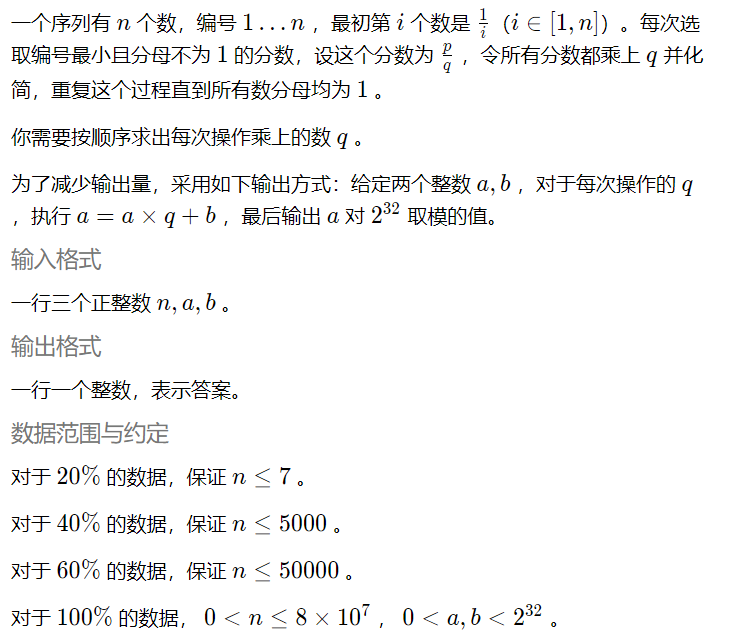
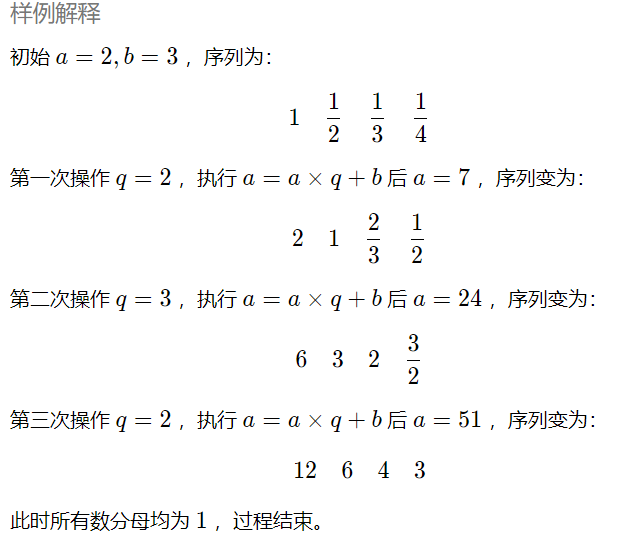
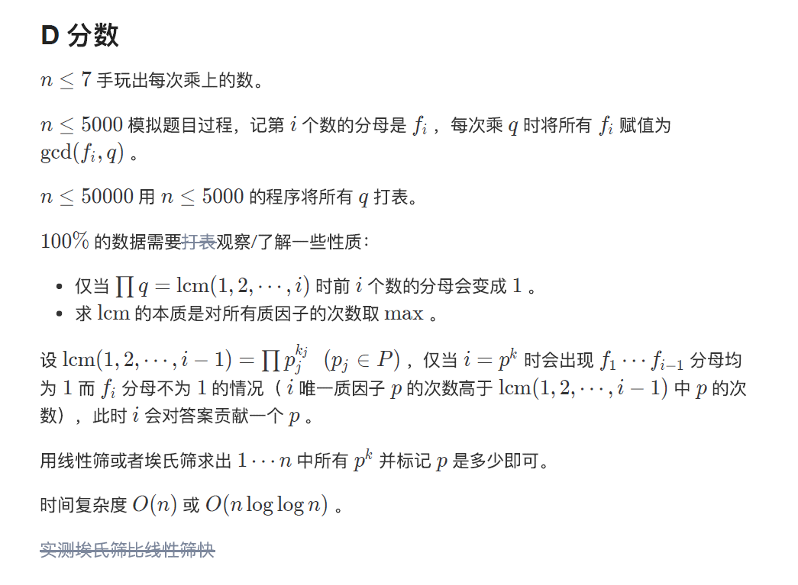
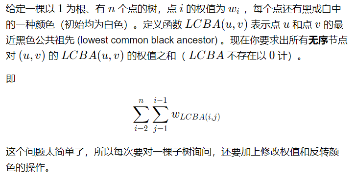
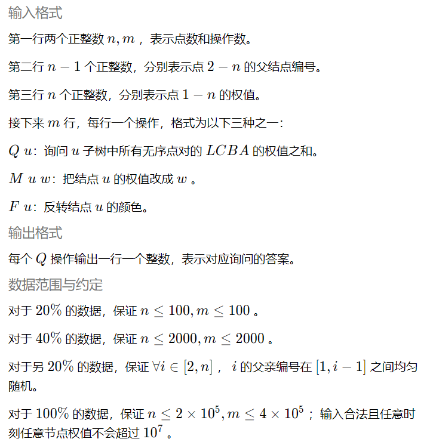
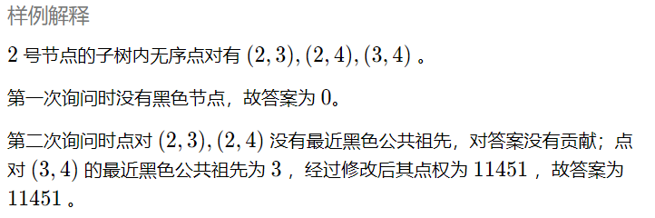

## 0809智算之道

和大爷在309、310，算一下拿银正好要308.7，过于戏剧了？？= = orz，求超越姐姐保佑好吧

在这里记录一下题和我和大爷的题解，毕竟比赛方的系统太垃圾了（确实

### CODE

#### B 大爷用DP满分了

题意：一个n*n的网格，左下是 (0,0) 右上角是 (n,n)。
我们要从左下角移动至右上角，移动规则两条
1.花费w1从 (a,b) 到达 (a,b+1) 或 (a+1,b) 。
2.如果(a,b)为魔法格点，我们既可以选择1.的策略，也可以花费w2从 (a,b) 到达 (a+1,b+1) .
求最少花费。

输入：
第一行输入 n,k,w1,w2
接下来 k 行，第 i 行两个整数 xi,yi，表示第 i 个魔法格点的坐标

输出：
一行一个整数，表示最少需要花费多少金币

数据范围:
对于 20% 的数据，保证 n <= 3 。
另外 20% ，保证魔法格点只出现在 (0,0) 到 (n,n) 的对角线上
100%的数据，保证1<=n,w1,w2<=10^9,0<=k<=2000,0 <= xi,yi < n魔法格点坐标两两不同。

样例输入
3 2 132 100
0 1
1 2

样例输出
464

```c++
#pragma warning (disable:4996)
#include <algorithm>
#include <iostream>
#include <iomanip>
#include <cstring>
#include <string>
#include <cmath>
#include <cstdio>
#include <queue>
#include <stack>
#include <set>
#include <list>
#include <map>
#define inf 0X7f7f7f7f
#define MS_I(x) memset(x,-inf,sizeof(x))
#define MS(x) memset(x,0,sizeof(x))
#define MS_1(x) memset(x,-1,sizeof(x))
#define MSI(x) memset(x,inf,sizeof(x))
#define random(a,b) ((long long)rand()%(b-a+1)+a)
#define MOD 998244353
using namespace std;
typedef long long ll;
typedef unsigned long long ull;
const int maxn = 1e7 + 10;

ll n, k, w1, w2;
int dp[2020];
pair<int, int> xy[2020];

double dis(pair<int, int> t)
{
	return (n - t.first) * (n - t.first) + (n - t.second) * (n - t.second);
}

bool cmp(pair<int, int> a, pair<int, int> b)
{
	double disa = dis(a), disb = dis(b);
	if (disa == disb)
		return a.first < b.first;
	return disa < disb;
}

int main()
{
	ll ans = 0;
	int cnt = -1;
	int tot = 0;
	bool flag = 0;
	scanf("%lld %lld %lld %lld", &n, &k, &w1, &w2);

	for (int i = 1; i <= k; i++)
	{
		int x, y;
		scanf("%d %d", &x, &y);
		if (!flag && x != y)
			flag = 1;
		xy[i] = make_pair(x, y);
	}
	if (w1 * 2 <= w2)
	{
		ans = 2 * n * w1;
		printf("%lld\n", ans);
		return 0;
	}
	if (!flag)
	{
		ans = w2 * k + 2 * w1 * (n - k);
		printf("%lld\n", ans);
		return 0;
	}
	if (n <= 3)
	{
		ans = w2 * 2 + 2 * w1 * (n - 2);
		printf("%lld\n", ans);
		return 0;
	}
	sort(xy + 1, xy + k + 1, cmp);
	for (int i = 1; i <= k; i++)
	{
		if (xy[i].first == n || xy[i].second == n)
			continue;
		tot = 0;
		for (int j = 1; j <= k; j++)
		{
			if (xy[i].first < xy[j].first && xy[i].second < xy[j].second && xy[j].first < n && xy[j].second < n && dis(xy[j]) != dis(xy[i]))
			{
				dp[i] = max(dp[i], dp[j]);
			}
		}
		dp[i]++;
		cnt = max(cnt, dp[i]);
	}
	ans = 2 * w1 * (n - cnt) + w2 * cnt;
	printf("%lld\n", ans);
	return 0;
}

```

#### C 有向无环图

- [ ] 这个靠大爷补了（补完记得打勾）（打勾的语法是‘ - [×] ’）

```c++
```

#### D 分数
只~~骗~~弄了20分让阿萌很生气，:( 深夜补题

题意：

样例输入：
4 2 3

样例输出：
5





```c++
### 明天补，还得交牛客报告呢，难受= =
```

#### E 树数数
似乎很难，有空题解出来贴题解看看算了，七天之后评测姬就挂了，~~反正我对图树一无所知~~
题意：



样例输入：
4 4
1 2 3
1 2 5 5
Q 2
F 3
M 3 11451
Q 2

样例输出：
0
11451



```c++
```